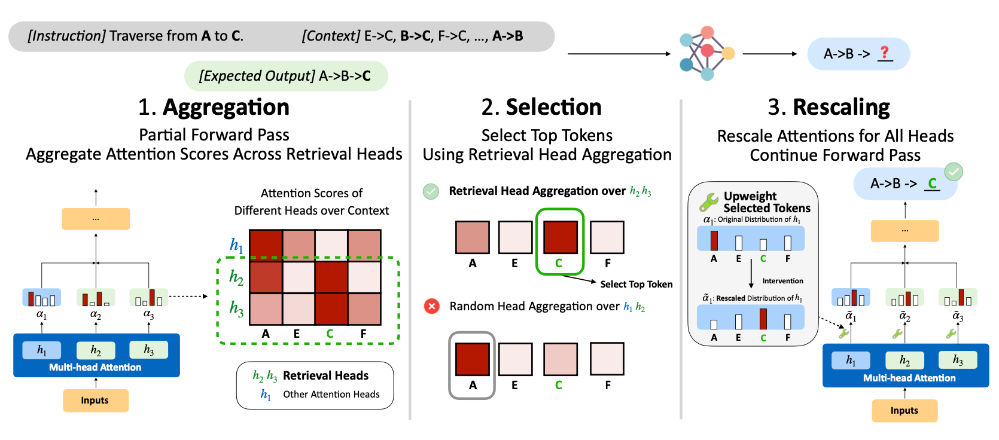

# DySCO: Dynamic Attention-Scaling Decoding for Long-Context LMs

[[DySCO Paper](https://arxiv.org/abs/2602.22175)]

[](https://huggingface.co/datasets/PrincetonPLI/DySCO)

**DySCO** is a training-free decoding algorithm that improves long-context reasoning for off-the-shelf LMs. At each decoding step, DySCO uses retrieval heads ([QRHeads](https://github.com/princeton-pli/QRHead) specifically) to identify task-relevant tokens in the context and explicitly up-weights them, dynamically adjusting attention during generation to better utilize relevant context. 

<p align="center">
  
</p>


## Installation

Please install the following packages:

* `torch` (tested with `2.6.0`)
* `transformers` (tested with `4.57.3`)
* `flash_attn` (tested with `2.8.3`)

Some other dependencies: `numpy`, `datasets`, `tqdm`, `pyyaml`.

## Setup

**1. Download evaluation data**

```bash
sh scripts/setup/prepare_data.sh
```
This downloads the evaluation data to `data_eval/`.

**2. Prepare models**

Please create a `models/` directory with symlinks to your model checkpoints for easy experiments:
```bash
mkdir -p models
ln -s /path/to/Qwen3-8B models/Qwen3-8B
```

For Qwen models, we create YaRN versions by symlinking the model weights and only modifying `config.json` to enable YaRN rope scaling. See [Qwen3-8B](https://huggingface.co/Qwen/Qwen3-8B) for YaRN instructions.

**3. Quick check**

Run a quick sanity check with 20 samples on `path_walking_16k` using Qwen3-8B:

```bash
sh scripts/setup/quick_check.sh
```

This runs both vanilla (Flash Attention) and DySCO generation. Expected results:
| Method | Accuracy |
|--------|----------|
| Vanilla | ~25% |
| DySCO | ~40% |

## Usage

We provide an standalone example in `dysco_inference_example.py`:

```python
import json, yaml, torch
from transformers import AutoTokenizer
from dysco.custom_modeling_qwen3 import RescaleQwen3ForCausalLM
from dysco.custom_mixin import DyscoConfig

# load model
tokenizer = AutoTokenizer.from_pretrained("models/Qwen3-8B")
model = RescaleQwen3ForCausalLM.from_pretrained(
    "models/Qwen3-8B",
    attn_implementation="flash_attention_2",
    device_map="auto",
    torch_dtype=torch.bfloat16,
)

# build DyscoConfig from yaml
with open("dysco_cfgs/qwen3_8b.yaml") as f:
    cfg = yaml.safe_load(f)
cfg["dysco_qrheads"] = eval(cfg["dysco_qrheads"])
dysco_config = DyscoConfig(**cfg)

# tokenize
input_ids = tokenizer.apply_chat_template(
    [{"role": "user", "content": "Your prompt here"}],
    tokenize=True, add_generation_prompt=True,
    return_tensors="pt", enable_thinking=False,
).to(model.device)

# generate with DySCO
generated_ids, logging_info = model.dysco_generate(
    input_ids,
    dysco_config=dysco_config,
    max_new_tokens=512,
    temperature=0.0,
    do_sample=False,
    pad_token_id=tokenizer.pad_token_id,
)

output = tokenizer.decode(generated_ids[0][input_ids.shape[1]:], skip_special_tokens=True)
```

Pre-built DySCO configs with detected QRHeads are provided in `dysco_cfgs/` for each supported model.

## TODO
[ ] Experiment scripts.

## Citation

Please cite our paper and the backbone QRHead if you find DySCO useful:

```bibtex
@article{ye2026dysco,
    title={DySCO: Dynamic Attention-Scaling Decoding for Long-Context LMs},
    author={Xi Ye and Wuwei Zhang and Fangcong Yin and Howard Yen and Danqi Chen},
    year={2026},
    eprint={2602.22175},
    archivePrefix={arXiv},
    primaryClass={cs.CL},
}

@inproceedings{zhang25qrhead,
    title={Query-Focused Retrieval Heads Improve Long-Context Reasoning and Re-ranking},
    author={Wuwei Zhang and Fangcong Yin and Howard Yen and Danqi Chen and Xi Ye},
    booktitle={Proceedings of EMNLP},
    year={2025}
}
```
